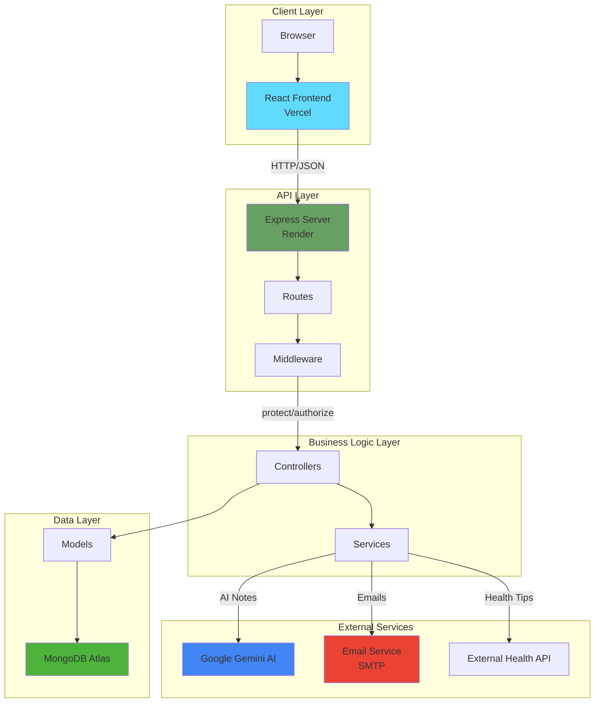

# DentOps - Software Design Commentary

> **Project:** DentOps - Dental Practice Management System  
> **Author:** Vedant  
> **GitHub:** [DentOps-Org/DentOps](https://github.com/DentOps-Org/DentOps)

---

## Table of Contents
- [Overview](#overview)
- [Design Improvements](#design-improvements)
- [Design Principles Applied](#design-principles-applied)
- [Key Refactoring & Enhancements](#key-refactoring--enhancements)
- [Architecture Diagram](#architecture-diagram)

---

## Overview

DentOps is a comprehensive dental practice management system built with a **Node.js/Express backend** and **React frontend**. The system manages appointments, patient records, inventory, staff availability, and integrates AI-powered features for enhanced clinical documentation.

The design emphasizes **modularity**, **security**, **scalability**, and **maintainability** through well-established software engineering principles and patterns.

---

## Design Improvements

### 1. **Layered Architecture (MVC Pattern)**

**Implementation:**
- **Models** (`src/models/`) - Mongoose schemas defining data structure and business logic
- **Controllers** (`src/controllers/`) - Request handling and business logic orchestration
- **Routes** (`src/routes/`) - API endpoint definitions with validation middleware
- **Views** (`src/views/`) - EJS templates for server-side rendering

**Benefits:**
- ✅ Clear separation of concerns
- ✅ Easy to test individual layers
- ✅ Improved code organization and maintainability
- ✅ Multiple team members can work on different layers simultaneously

**Example:**
```javascript
// Model: src/models/User.js
const UserSchema = new mongoose.Schema({
  fullName: { type: String, required: true },
  email: { type: String, required: true, unique: true },
  role: { type: String, enum: ['DENTAL_STAFF', 'PATIENT'] }
});

// Controller: src/controllers/auth.js
exports.register = async (req, res) => {
  const user = await User.create(req.body);
  sendTokenResponse(user, 201, res);
};

// Route: src/routes/auth.js
router.post('/register', [validationMiddleware], register);
```

---

### 2. **Service Layer Pattern**

**Implementation:**
Created dedicated service modules in `src/services/` to encapsulate complex business logic:
- `emailService.js` - Email notification handling
- `aiService.js` - AI-powered treatment note expansion
- `externalApi.js` - Third-party API integrations

**Benefits:**
- ✅ **Reusability:** Services can be used across multiple controllers
- ✅ **Testability:** Business logic isolated from HTTP layer
- ✅ **Single Responsibility:** Each service has one clear purpose
- ✅ **Loose Coupling:** Controllers don't need to know implementation details

**Example:**
```javascript
// src/services/emailService.js
const sendWelcomeEmail = async (user) => {
  const html = welcomeEmailTemplate(user);
  return await sendEmail({
    to: user.email,
    subject: `Welcome to DentOps, ${user.fullName}! 🦷`,
    html
  });
};

// Used in controller without tight coupling
await emailService.sendWelcomeEmail(user);
```

---

### 3. **Middleware-Based Security**

**Implementation:**
- `protect` middleware - JWT token verification
- `authorize` middleware - Role-based access control (RBAC)
- `helmet` - Security headers
- Input validation using `express-validator`

**Benefits:**
- ✅ Centralized authentication logic
- ✅ Prevents code duplication across routes
- ✅ Easy to apply security to new endpoints
- ✅ Defense in depth through multiple security layers

**Example:**
```javascript
// src/middleware/auth.js
exports.protect = async (req, res, next) => {
  const token = req.headers.authorization?.split(' ')[1];
  const decoded = jwt.verify(token, process.env.JWT_SECRET);
  req.user = await User.findById(decoded.id);
  next();
};

exports.authorize = (...allowed) => {
  return (req, res, next) => {
    if (!allowed.includes(req.user.role) && !allowed.includes(req.user.specialization)) {
      return res.status(403).json({ message: 'Not authorized' });
    }
    next();
  };
};

// Usage in routes
router.get('/appointments/requests', 
  protect, 
  authorize('CLINIC_MANAGER'), 
  listRequests
);
```

---

### 4. **Modular Validation Utilities**

**Implementation:**
Created `src/utils/validators.js` with reusable validation functions:
- `validatePassword()` - Password strength validation
- `validateEmail()` - Email format validation
- `validatePhone()` - Phone number sanitization and validation

**Benefits:**
- ✅ DRY principle - validation logic not duplicated
- ✅ Easy to test in isolation
- ✅ Consistent validation across the application
- ✅ Single source of truth for validation rules

---

### 5. **Schema-Level Data Validation**

**Implementation:**
Mongoose schemas enforce data integrity at the database layer:
- Custom validators for phone numbers (exactly 11 digits)
- Email format validation with regex
- Password encryption via pre-save hooks
- Role-specific field requirements

**Benefits:**
- ✅ Data integrity guaranteed at DB level
- ✅ Prevents invalid data from being persisted
- ✅ Custom error messages for better UX
- ✅ Automatic data transformation (e.g., email lowercase)

**Example:**
```javascript
// src/models/User.js
phone: {
  type: String,
  required: [true, 'Phone number is required'],
  unique: true,
  validate: {
    validator: function(v) {
      return /^\d{11}$/.test(v);
    },
    message: 'Phone number must be exactly 11 digits'
  }
}
```

---

### 6. **Environment-Based Configuration**

**Implementation:**
- Environment variables for all sensitive data
- Different configurations for development, production, and test
- `.env` file for local development
- Production variables set via hosting platform (Render, Vercel)

**Benefits:**
- ✅ No secrets in source code (security)
- ✅ Easy deployment across different environments
- ✅ Configuration changes don't require code changes
- ✅ Follows 12-factor app methodology

---

## Design Principles Applied

### 1. **Separation of Concerns (SoC)**

**Where Applied:**
- **MVC Architecture:** Business logic (controllers) separated from data (models) and presentation (views)
- **Service Layer:** Email, AI, and API logic separated from controllers
- **Middleware:** Authentication/authorization separated from route handlers
- **Utilities:** Validation logic isolated in dedicated modules

**Impact:**
- Each module has a single, well-defined responsibility
- Changes in one area don't ripple through the entire codebase
- Easier to locate and fix bugs
- New team members can understand the system faster

---

### 2. **Don't Repeat Yourself (DRY)**

**Where Applied:**

**Before Refactoring:**
```javascript
// Phone validation scattered across controllers
if (!/^\d{11}$/.test(phone)) {
  return res.status(400).json({ message: 'Invalid phone' });
}
```

**After Refactoring:**
```javascript
// Centralized in validators.js
const { valid, message, sanitizedPhone } = validatePhone(phone);
if (!valid) {
  return res.status(400).json({ success: false, message });
}
```

**Other Applications:**
- JWT token generation encapsulated in `User.getSignedJwtToken()`
- Password hashing automated via Mongoose pre-save hook
- Email template logic reused across different notification types
- Middleware functions used across multiple routes

---

### 3. **Single Responsibility Principle (SRP)**

**Where Applied:**

| Component | Single Responsibility |
|-----------|----------------------|
| `User.js` model | User data structure and authentication methods |
| `auth.js` controller | User registration, login, and session management |
| `emailService.js` | Email composition and sending |
| `aiService.js` | AI integration for treatment notes |
| `protect` middleware | JWT token validation |
| `authorize` middleware | Role-based access control |
| `validators.js` | Input validation utilities |

**Impact:**
- Changes to email templates don't affect authentication logic
- AI service can be swapped out without touching appointment controllers
- Testing is easier because each component has clear boundaries

---

### 4. **Secure by Design**

**Where Applied:**

| Security Feature | Implementation | Location |
|-----------------|----------------|----------|
| **Password Encryption** | bcrypt hashing before save | `src/models/User.js` pre-save hook |
| **JWT Authentication** | Token-based stateless auth | `src/middleware/auth.js` |
| **Role-Based Access Control** | Granular permissions by role/specialization | `src/middleware/auth.js` authorize |
| **Input Validation** | express-validator + custom validators | `src/routes/*.js` + `src/utils/validators.js` |
| **SQL Injection Prevention** | Mongoose ODM parameterized queries | All models |
| **Security Headers** | Helmet middleware | `src/server.js` |
| **CORS Control** | Explicit origin whitelist | `src/server.js` |
| **Environment Variables** | Secrets never in code | `.env` file |

**Impact:**
- Passwords never stored in plaintext
- Protected routes require valid JWT token
- Unauthorized users cannot access restricted resources
- Input sanitization prevents common attacks

---

### 5. **Open/Closed Principle**

**Where Applied:**

**Middleware Composition:**
Routes are open for extension (add more middleware) but closed for modification:
```javascript
router.get('/appointments/requests', 
  protect,                        // Can add more middleware here
  authorize('CLINIC_MANAGER'),   // Without modifying existing functions
  listRequests
);
```

**Service Extensions:**
New email types can be added without modifying core email sending logic:
```javascript
// Easy to add new email types
const sendPasswordResetEmail = async (user, resetLink) => {
  const html = passwordResetTemplate(user, resetLink);
  return await sendEmail({ to: user.email, subject: '...', html });
};
```

---

### 6. **Fail Fast Principle**

**Where Applied:**
- Early validation at route level (express-validator)
- Controller-level validation before processing
- Model-level validation before database write
- Service-level error checking before external API calls

**Example:**
```javascript
// Route validation
router.post('/register', [
  check('email').isEmail(),
  check('password').isLength({ min: 6 })
], register);

// Controller validation
const phoneValidation = validatePhone(phone);
if (!phoneValidation.valid) {
  return res.status(400).json({ message: phoneValidation.message });
}

// Model validation
phone: {
  validate: {
    validator: (v) => /^\d{11}$/.test(v),
    message: 'Phone number must be exactly 11 digits'
  }
}
```

**Impact:**
- Errors caught early before expensive operations
- Better user experience with immediate feedback
- Prevents invalid data from propagating through the system

---

### 7. **Dependency Inversion Principle**

**Where Applied:**

Controllers depend on **abstractions** (service interfaces) rather than concrete implementations:

```javascript
// Controller depends on emailService abstraction
const emailService = require('../services/emailService');
await emailService.sendWelcomeEmail(user);

// emailService can be swapped for different implementations:
// - SMTP (Nodemailer) - current
// - SendGrid API
// - AWS SES
// - Mock service for testing
```

**Impact:**
- Easy to swap email providers without changing controllers
- Can use mock services for testing
- Reduced coupling between modules

---

## Key Refactoring & Enhancements

### 1. **Phone Number Validation & Sanitization** 🔧

**Problem:**
- Inconsistent phone number formats (spaces, dashes, country codes)
- Database had mixed formats: "123-456-7890", "12345678901", "+1 234 567 8901"
- Validation errors unclear to users

**Solution:**
```javascript
// src/utils/validators.js
function validatePhone(phone) {
  // Strip all non-numeric characters
  const sanitized = phone.toString().replace(/\D/g, '');
  
  if (sanitized.length !== 11) {
    return { 
      valid: false, 
      message: 'Phone number must be exactly 11 digits' 
    };
  }
  
  return { 
    valid: true, 
    sanitizedPhone: sanitized 
  };
}
```

**Impact:**
- ✅ Consistent phone format in database: "12345678901"
- ✅ User-friendly: accepts "(123) 456-7890" and converts automatically
- ✅ Prevents duplicate registrations with different formats
- ✅ Easier to implement SMS/WhatsApp integrations later

---

### 2. **Email Service Integration** 📧

**Problem:**
- No automated notifications for users
- Manual communication required for appointment confirmations
- Poor user experience

**Solution:**
Created dedicated email service with:
- Template-based emails (welcome, appointment confirmation)
- Separate emails for patients and dentists
- Graceful degradation (registration succeeds even if email fails)
- Environment-based configuration

**Files Modified/Created:**
- ✅ `src/services/emailService.js` (NEW)
- ✅ `src/templates/email/welcomeEmail.js` (NEW)
- ✅ `src/templates/email/appointmentConfirmation.js` (NEW)
- ✅ `src/controllers/auth.js` (Modified - added welcome email)
- ✅ `src/controllers/appointments.js` (Modified - added confirmation emails)

**Impact:**
- ✅ Professional automated welcome emails
- ✅ Appointment confirmations sent to both patient and dentist
- ✅ Improved user engagement and experience
- ✅ Reduced manual workload for clinic staff

---

### 3. **AI-Powered Treatment Notes** 🤖

**Problem:**
- Dentists write brief notes during appointments
- Converting brief notes to professional clinical documentation takes time
- Inconsistent documentation quality

**Solution:**
Integrated Google Gemini AI to expand brief notes into professional clinical documentation:

```javascript
// src/services/aiService.js
async function expandTreatmentNotes(briefNotes) {
  const model = genAI.getGenerativeModel({ model: 'gemini-2.0-flash' });
  
  const prompt = `You are a professional dental assistant helping dentists write detailed patient records.
  
  Given the following brief treatment notes, expand them into a comprehensive, professional clinical note...
  
  Brief notes: "${briefNotes}"`;
  
  const result = await model.generateContent(prompt);
  return result.response.text().trim();
}
```

**Integration:**
- ✅ `/api/ai/expand-notes` endpoint
- ✅ Frontend UI with "Expand with AI" button
- ✅ Accept/Discard workflow for dentist review
- ✅ Error handling for API failures

**Impact:**
- ✅ Saves dentists 5-10 minutes per patient
- ✅ Consistent professional documentation
- ✅ Proper dental terminology and formatting
- ✅ Improved patient record quality

---

### 4. **Role-Based Authorization Enhancement** 🔐

**Problem:**
Initial authorization only checked user role (`PATIENT` vs `DENTAL_STAFF`), but didn't differentiate between `DENTIST` and `CLINIC_MANAGER` specializations.

**Solution:**
Enhanced `authorize` middleware to check both role and specialization:

```javascript
// Before
exports.authorize = (...roles) => {
  return (req, res, next) => {
    if (!roles.includes(req.user.role)) {
      return res.status(403).json({ message: 'Not authorized' });
    }
    next();
  };
};

// After
exports.authorize = (...allowed) => {
  return (req, res, next) => {
    const userRole = req.user.role;
    const userSpec = req.user.specialization;
    
    const ok = allowed.some(a => a === userRole || a === userSpec);
    
    if (!ok) {
      return res.status(403).json({ message: 'Not authorized' });
    }
    next();
  };
};
```

**Usage:**
```javascript
// Only clinic managers can view pending appointment requests
router.get('/appointments/requests', 
  protect, 
  authorize('CLINIC_MANAGER'), 
  listRequests
);

// Only dentists can complete appointments
router.post('/appointments/:id/complete', 
  protect, 
  authorize('DENTIST'), 
  completeAppointment
);
```

**Impact:**
- ✅ Granular access control
- ✅ Prevents unauthorized operations
- ✅ Clear separation of clinic manager and dentist responsibilities

---

### 5. **Appointment Workflow Redesign** 📅

**Problem:**
- Initial design had complex scheduling logic
- Time slot conflicts
- No clear pending request workflow

**Solution:**
Implemented **FCFS (First-Come-First-Served) pending request system**:

**Workflow:**
1. **Patient:** Creates appointment request (status: `PENDING`)
2. **Manager:** Views pending requests ordered by creation time
3. **Manager:** Confirms request with dentist + time slot
4. **System:** 
   - Validates slot availability
   - Validates dentist availability
   - Updates status to `CONFIRMED`
   - Sends emails to patient and dentist

**Key Functions:**
- `createAppointment()` - Patient creates pending request
- `listRequests()` - Manager views FCFS queue
- `confirmAppointment()` - Manager assigns dentist + time
- `getAvailableSlots()` - Check dentist availability

**Impact:**
- ✅ No double-bookings
- ✅ Clear pending request queue
- ✅ Manager has full control over scheduling
- ✅ Patients receive timely confirmations

---

### 6. **Environment-Based Error Handling** 🐛

**Implementation:**
```javascript
// src/server.js
if (process.env.NODE_ENV === 'development') {
  app.use(morgan('dev')); // Detailed logging only in dev
}

if (process.env.NODE_ENV !== 'test') {
  app.listen(PORT); // Don't start server during tests
}

// Email service
if (!process.env.EMAIL_USER || !process.env.EMAIL_PASSWORD) {
  console.warn('⚠️  Email service not configured. Skipping...');
  return { success: false, message: 'Email service not configured' };
}
```

**Impact:**
- ✅ Development: detailed logs for debugging
- ✅ Production: minimal logging, secure headers
- ✅ Testing: controlled environment, no port conflicts
- ✅ Graceful degradation when services unavailable

---

### 7. **Testing Infrastructure** ✅

**Added:**
- Jest configuration (`jest.config.js`)
- Unit tests for validators (`tests/unit/validators.test.js`)
- Integration tests for auth endpoints
- Test environment isolation

**Files:**
```
tests/
├── unit/
│   └── validators.test.js    # Password, email, phone validation
└── integration/
    └── auth.test.js          # Registration, login flows
```

**Impact:**
- ✅ Confidence in validation logic
- ✅ Catch regressions early
- ✅ Documentation through tests
- ✅ Safe refactoring

---

## Architecture Diagram



---

## Summary

DentOps demonstrates strong software engineering practices through:

✅ **Modular Architecture** - MVC + Service Layer separation  
✅ **Security First** - JWT auth, RBAC, input validation, secure password storage  
✅ **Code Reusability** - DRY principle through services and utilities  
✅ **Maintainability** - Clear separation of concerns, single responsibility  
✅ **Scalability** - Stateless authentication, service abstraction  
✅ **Modern Features** - AI integration, automated emails, external API usage  
✅ **Quality Assurance** - Unit and integration testing  

**Key Refactoring Achievements:**
1. Phone validation and sanitization system
2. Professional email notification service
3. AI-powered clinical documentation
4. Enhanced role-based authorization
5. Robust appointment workflow
6. Comprehensive testing infrastructure

The design allows for easy extension (new services, features) while maintaining stability of existing functionality.

---

**GitHub Repository:** [DentOps-Org/DentOps](https://github.com/DentOps-Org/DentOps)  
**Live Demo:** [DentOps Demo](https://dentops.vercel.app)
